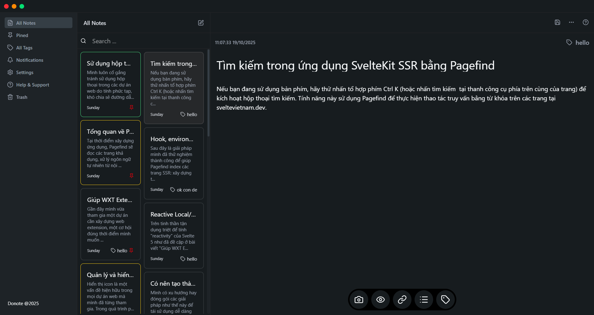

# 📝 Donote — Cross-platform Note App built with Tauri



**Donote** is a lightweight, fast, and secure note-taking application built with [Tauri](https://tauri.app), offering a smooth writing experience across **Windows**, **macOS**, and **Linux**, **IOS**, **Android**
It focuses on simplicity, privacy, and performance — giving you a clean workspace for your thoughts, ideas, and daily notes.

---

## ✨ Features

### 🗒️ Smart Notes
- Create, edit, and delete notes instantly with a distraction-free interface.  
- All notes are stored locally by default, ensuring your privacy and full data ownership.  
- Markdown syntax supported — great for developers, writers, and creators.

### 🗂️ Folder & Tag Management
- Organize your notes into **folders** and **tags** to keep your workspace clean.  
- Quick search by keyword or tag for instant access to your ideas.  
- Move notes between folders with a simple drag-and-drop action.

### 🌈 Custom Themes
- Choose from built-in themes or create your own color palette.  
- Support for light and dark mode, adapting to your system theme automatically.  
- Designed with Tailwind-like color consistency for an elegant UI.

### ☁️ Cross-Platform Power
- Powered by **Tauri**, Donote runs natively on Windows, macOS, and Linux.  
- Ultra-small binary size (~10 MB) and blazing-fast startup time.  
- Uses system resources efficiently while keeping your notes secure in local storage.

### 🔔 Notifications & Auto-Sync (optional)
- Optional integration with cloud sync services (Firebase, local backup).  
- Built-in reminder system for daily journaling or important tasks.

---

## 🧩 Tech Stack

| Layer | Technology |
|-------|-------------|
| UI | HTML, CSS, JavaScript, TailwindCSS |
| Framework | SvelteKit |
| Backend | Tauri (Rust) |
| Storage | IndexedDB / Local JSON store |
| Build | Vite + Tauri CLI |

---

## 🖼️ Screenshots

| Home | Editor | Folder View |
|------|---------|--------------|
|  |  |  |


---

## 🚀 Installation

### Using prebuilt binaries
Download the latest version from the [Releases](https://github.com/yourusername/donote/releases) page.

### Build from source
```bash
# Clone the repository
git clone https://github.com/yourusername/donote.git
cd donote

# Install dependencies
npm install

# Run in development
npm run tauri dev

# Build release
npm run tauri build
